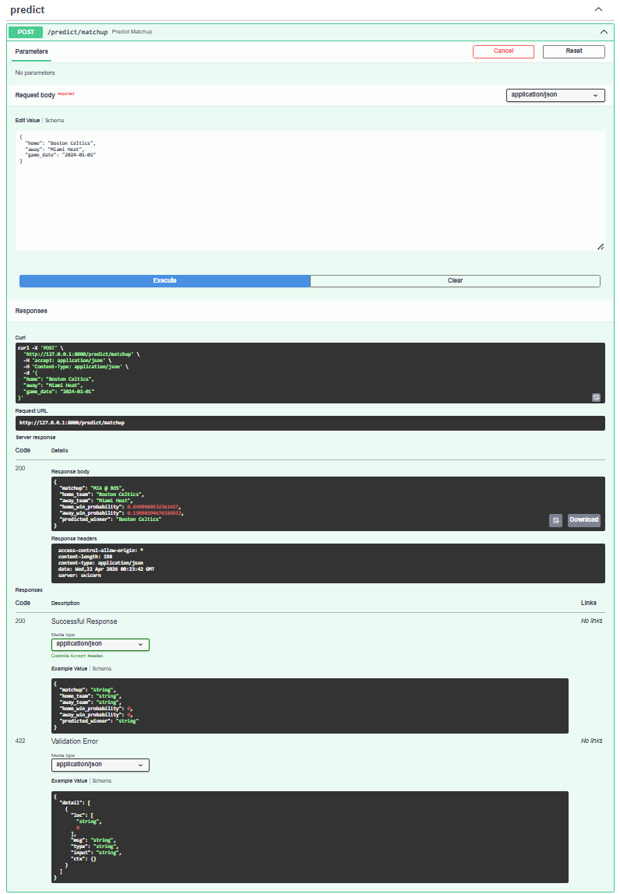
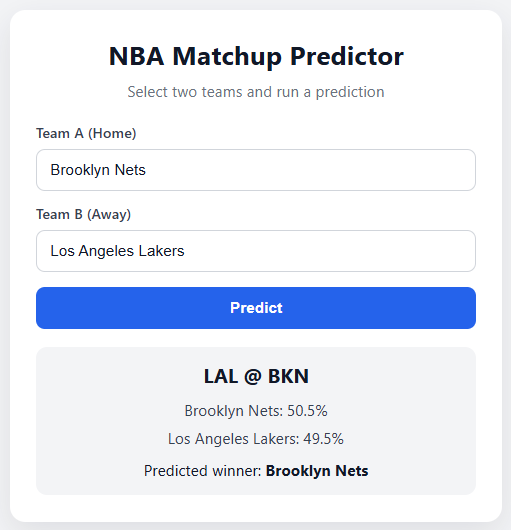
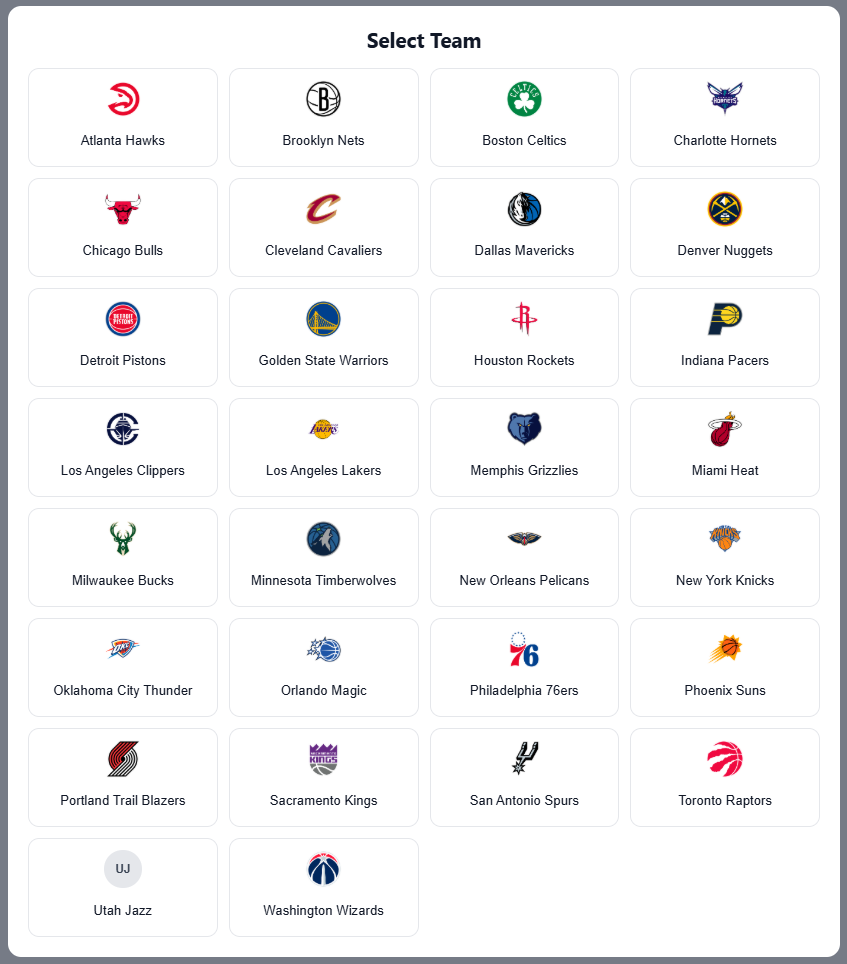

# NBA Probabilistic Forecasting Platform

Full-stack NBA prediction platform with live API and UI.

**Live Frontend URL:**  
https://hoopsedge.onrender.com

**API Docs URL:**  
https://nba-probabilistic-forecasting.onrender.com/docs

---

## Live Demo

- Frontend: https://hoopsedge.onrender.com
- API Docs (Swagger): https://nba-probabilistic-forecasting.onrender.com/docs
- Base API: https://nba-probabilistic-forecasting.onrender.com

## Features

- Matchup win-probability predictions
- Player prop probability scoring
- FastAPI backend with interactive Swagger docs
- React UI for team selection and live predictions
- Lightweight inference runtime using CSV features + serialized models

## Tech Stack

- Python 3 + FastAPI
- scikit-learn + joblib
- pandas + numpy + scipy
- React + Vite
- Render (frontend + API deployment)

## Architecture Overview

- `app/main.py`: app assembly only
- `app/api/routes/*`: HTTP layer
- `app/services/*`: business logic and inference
- `app/schemas/*`: request/response contracts
- `app/core/config.py`: runtime config and paths
- `app/utils/*`: shared helper utilities

---

## Overview

Full-stack sports analytics platform for predicting NBA game outcomes and player props using historical data, engineered features, and machine learning models.

The system includes:

- a FastAPI backend serving real-time predictions via a REST API
- a React frontend for interactive matchup analysis
- an offline data pipeline for ingestion, feature engineering, and model training

The project is designed with production-style architecture, separating data pipelines, model inference, and API layers into modular components.

## Built with a production-style architecture and deployed-ready API design to simulate real-world backend systems.

## Demo

### API (Swagger UI)



### Main Interface

Interactive frontend for selecting matchups and viewing model predictions.



### Team Selection UI



---

## Tech Stack

- Python 3
- FastAPI
- scikit-learn (joblib)
- pandas + numpy + scipy
- React + Vite
- Render

## Architecture

```text
                +----------------------+
                |   React Frontend     |
                |   (Vite, fetch API)  |
                +----------+-----------+
                           |
                           | HTTP (JSON)
                           v
                +----------+-----------+
                |      FastAPI App     |
                |      app/main.py     |
                +----+----------+------+
                     |          |
          +----------+          +------------------+
          v                                     v
+---------------------+              +----------------------+
|   Route Layer       |              |   Schema Layer       |
| app/api/routes/*.py |              | app/schemas/*.py     |
+----------+----------+              +----------------------+
           |
           v
+----------+----------+
|   Service Layer     |
| app/services/*.py   |
| - data_service      |
| - team_service      |
| - model_service     |
+----------+----------+
           |
           v
+----------+----------+      +-------------------------+
| Processed CSV data  |      | Models (models/*.pkl)   |
| data/*.csv          |      | sklearn/joblib artifacts|
+---------------------+      +-------------------------+

Pipelines (pipelines/*.py) build runtime CSV/model artifacts offline.
```

## Features

- Matchup probability API:
  - `POST /predict/matchup`
  - `GET /predict/quick?home=...&away=...`
- Teams API:
  - `GET /teams/`
- Player props API:
  - `GET /props/players`
  - `POST /props/predict`
- Historical ingestion and feature pipelines:
  - `pipelines/ingest.py`
  - `pipelines/build_features.py`
  - `pipelines/train.py`
- Player workflow pipelines:
  - `pipelines/ingest_balldontlie.py`
  - `pipelines/ingest_nba_api.py` (free NBA.com/stats path via `nba_api`)
  - `pipelines/build_player_features.py`
  - `pipelines/train_player_model.py`
  - `pipelines/predict_player_props.py`
- Play-by-play aggregation:
  - `pipelines/build_player_game_stats.py`

## Current Status

- Game outcome prediction: fully deployed
- Player prop prediction: in progress (pipeline exists but not deployed due to data scaling constraints)

## Model Performance

Current out-of-sample game model performance (2018-2023):

- Log Loss: `0.633`
- Brier Score: `0.221`
- Accuracy: `64.4%`

Baseline (always pick home team): `56.5%` accuracy.

## Setup

```powershell
python -m venv .venv
.\.venv\Scripts\activate
pip install -r requirements.txt
```

## Run Backend

```powershell
uvicorn app.main:app --host 0.0.0.0 --port 10000
```

## Run Frontend

```powershell
cd frontend
copy .env.example .env
npm install
npm run dev
```

Frontend environment variable:

```env
VITE_API_BASE=http://localhost:8000
```

## API Endpoints

```text
GET  /health
GET  /teams/
GET  /predict/quick?home=...&away=...
POST /predict/matchup
GET  /props/players
POST /props/predict
```

## Build Player Prop Artifacts

The free path uses NBA.com/stats through the `nba_api` package:

```bash
python pipelines/ingest_nba_api.py
python pipelines/build_player_features.py
python pipelines/train_player_model.py
```

You can fetch explicit seasons with repeated `--season` flags:

```bash
python pipelines/ingest_nba_api.py --season 2023-24 --season 2024-25 --season 2025-26
```
