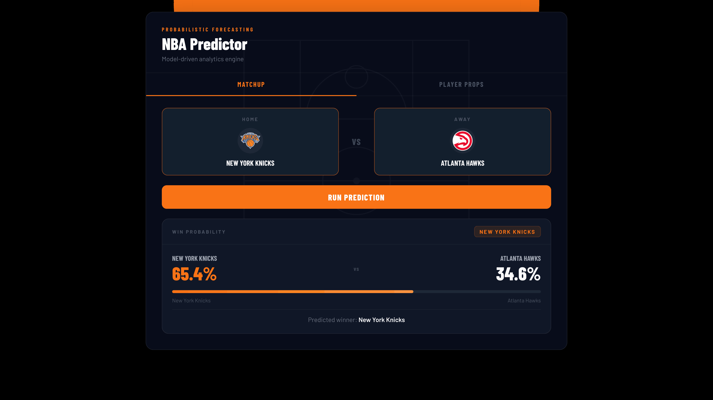
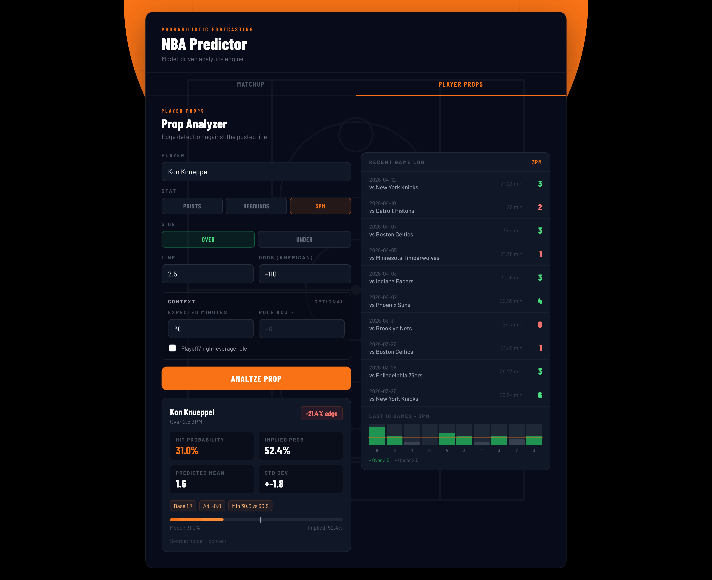

# NBA Probabilistic Forecasting Platform

Full-stack NBA analytics app for matchup win probabilities and player prop edge detection.

**Live frontend:** https://hoopsedge.onrender.com  
**API docs:** https://nba-probabilistic-forecasting.onrender.com/docs  
**Base API:** https://nba-probabilistic-forecasting.onrender.com

## Overview

This project combines a FastAPI prediction API, a React/Vite frontend, and offline data/model pipelines for NBA forecasting.

The frontend currently supports two workflows:

- **Matchup Predictor:** select home and away teams, then view model-generated win probabilities and predicted winner.
- **Player Prop Analyzer:** search players, choose points/rebounds/3PM, enter a line and American odds, then compare model hit probability against implied probability.

The API serves predictions from processed CSV artifacts and serialized scikit-learn/joblib models. Offline pipelines ingest data, build serving features, and train the matchup and player prop models.

## Demo

### Matchup Predictor



### Player Prop Analyzer



### API Docs


## Features

- Matchup win-probability predictions.
- Searchable team selector with NBA logos and fallback initials.
- Player prop probability scoring for:
  - points
  - rebounds
  - made threes (`3ps`)
- Over/under edge calculation using American odds implied probability.
- Optional player context adjustments:
  - expected minutes
  - role/usage adjustment percentage
  - playoff/high-leverage mode
- Recent game log endpoint and mini chart for selected player props.
- FastAPI Swagger documentation.
- Modular service, schema, route, and pipeline layers.

## Tech Stack

- Python 3
- FastAPI
- pandas, numpy, scipy
- scikit-learn, joblib
- DuckDB
- React 18 + Vite
- Render deployment

## Architecture

```text
                +----------------------+
                |   React Frontend     |
                |   frontend/src       |
                +----------+-----------+
                           |
                           | HTTP JSON
                           v
                +----------+-----------+
                |      FastAPI App     |
                |      app/main.py     |
                +----+----------+------+
                     |          |
          +----------+          +------------------+
          v                                     v
+---------------------+              +----------------------+
|   Route Layer       |              |   Schema Layer       |
| app/api/routes/*.py |              | app/schemas/*.py     |
+----------+----------+              +----------------------+
           |
           v
+----------+----------+
|   Service Layer     |
| app/services/*.py   |
| - data_service      |
| - team_service      |
| - model_service     |
+----------+----------+
           |
           v
+----------+----------+      +-------------------------+
| Runtime CSV data    |      | Model artifacts         |
| data/*.csv          |      | models/*.pkl            |
+---------------------+      +-------------------------+

Offline pipelines in pipelines/*.py and sql/*.sql build the CSV/model artifacts.
```

## API Endpoints

```text
GET  /
GET  /health
GET  /teams/
GET  /predict/quick?home=...&away=...
POST /predict/matchup
GET  /props/players
GET  /props/recent-games?player=...&line_type=points&limit=10
POST /props/predict
```

Example player prop request:

```json
{
  "player": "Jayson Tatum",
  "line_type": "points",
  "side": "over",
  "line": 27.5,
  "odds": -110,
  "expected_minutes": 38,
  "usage_adjustment_pct": 5,
  "playoff_mode": false
}
```

## Project Structure

```text
app/
  api/routes/        FastAPI route handlers
  core/config.py     Runtime paths and settings
  schemas/           Request/response models
  services/          Prediction and data-loading logic
  utils/             Shared feature helpers
frontend/
  src/App.jsx        Main React application
  src/App.css        Frontend styling
pipelines/           Data ingestion, feature building, and training scripts
sql/                 DuckDB feature SQL
data/                Runtime CSV artifacts
models/              Serialized model artifacts
assets/              README/demo images
```

## Local Setup

Create and activate a Python environment, then install backend dependencies:

```bash
python -m venv .venv
source .venv/bin/activate
pip install -r requirements.txt
```

On Windows PowerShell:

```powershell
python -m venv .venv
.\.venv\Scripts\activate
pip install -r requirements.txt
```

Install frontend dependencies:

```bash
cd frontend
npm install
cp .env.example .env
```

For Windows PowerShell:

```powershell
cd frontend
npm install
copy .env.example .env
```

The frontend expects this environment variable:

```env
VITE_API_BASE=http://localhost:8000
```

## Run Locally

Start the API:

```bash
uvicorn app.main:app --reload --host 0.0.0.0 --port 8000
```

Start the frontend in another terminal:

```bash
cd frontend
npm run dev
```

Open the Vite URL shown in the terminal. Swagger docs are available at:

```text
http://localhost:8000/docs
```

## Build Frontend

```bash
cd frontend
npm run build
```

## Data and Model Pipelines

Matchup workflow:

```bash
python pipelines/ingest.py
python pipelines/build_features.py
python pipelines/train.py
python pipelines/build_serving_data.py
```

Player prop workflow using NBA.com/stats through `nba_api`:

```bash
python pipelines/ingest_nba_api.py
python pipelines/build_player_game_stats.py
python pipelines/build_player_features.py
python pipelines/train_player_model.py
```

Fetch explicit seasons with repeated `--season` flags:

```bash
python pipelines/ingest_nba_api.py --season 2023-24 --season 2024-25 --season 2025-26
```

DuckDB-based player feature build:

```bash
python pipelines/build_player_features_duckdb.py
```

## Model Performance

Current out-of-sample matchup model performance from the existing README benchmark:

- Log Loss: `0.633`
- Brier Score: `0.221`
- Accuracy: `64.4%`

Baseline accuracy from always picking the home team: `56.5%`.

## Notes

- `data/` and `models/` artifacts are required for local inference.
- The first request to the hosted API may be slower while the Render service wakes up.
- Player prop predictions fall back from trained prop models to rolling/recent averages when model artifacts or feature columns are unavailable.
